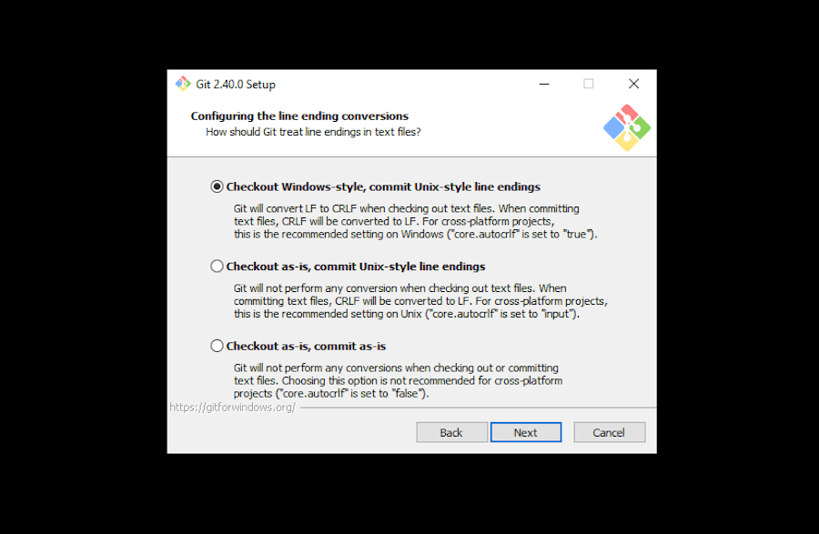

# Setup Git VCS

The club should have this set up for you....
if not, visit [Installing Git](https://git-scm.com/book/en/v2/Getting-Started-Installing-Git)
from Chacon's Pro Git book.

Notably to Windows users, you want to core.autocrlf set to **true**.
If you are just installing, make sure to select *this* option
as you are going through installation wizard:

[](https://kinsta.com/blog/install-git/#windows-2)

If you are already done installing run:

```
### Run this in CMD.exe (if you added git to PATH) or Git-Bash
$ git config --global core.autocrlf true
```

Confirm that you have done so by seeing if this command prints true.

```
$ git config core.autocrlf
true
```

(For a history lecture on how computer systems diverged in their
native representation of line endings, [see here](../gentle/check#part-02-flavors-of-text-files-crlf-lf-cr).)
