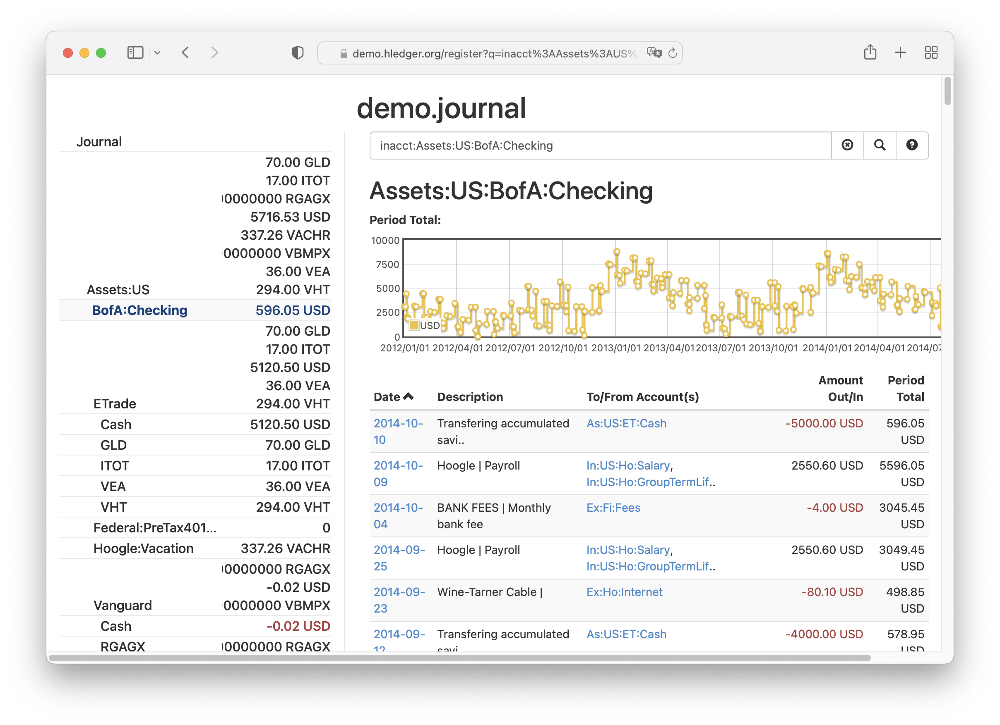

# Ideas: Graphical Ledger

[One of the [ideas](.)]

deyan> Create a finance app that tracks your expenses and creates graphs based on the data.

ethan> A double-entry, currency and account agonistic bookkeeping extension/interface
to any one of the well-known plain text accounting apps (ledger, hledger,
beancount), that (again) supports metadata: **in particular** the date of
transaction (down to seconds precision, again; though it should take note
of significance when the ledgers from banks do not offer such precision),
date of posting, transaction ID.  And understands budgets.  Bonus point
if it is general-purposed enough to be re-used for any kind of exchange
(such as time in exchange of money; or in-game tokens in exchange of other
in-game resources).  Bonus point if (as Deyan proposes above) it can
draw pretty graphs.  Extra bonus points again if it is FOSS too.

*Possible example of this* from [hledger-web](https://hledger.org/):

## Software Stack

Qt or React.js?

## Milestones

[Will be added if we go with this idea]
