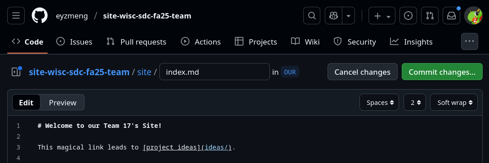
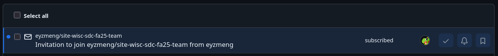

# How to use this site

## Editing

On the left ribbon (or on mobile, the top)
you should see an "Edit on GitHub" link.
The way it works [isn't really magic](https://github.com/rapidcow/site-wisc-sdc-fa25-team/blob/gh-pages/site/_layouts/default.html#L35-L39),
it's just a convenient shortcut for:

```
https://github.com/eyzmeng/site-wisc-sdc-fa25-team/edit/OUR/site/<MD-FILE>
```

where `<MD-FILE>` is just the current page.  You can replace
`<MD-FILE>` with literally any other file.

The nice thing about GitHub is that, when you do this, you
get a nice in-browser text editor:



The green "Commit changes..." button will become activated
once you make any changes.  Click it and submit your changes
and you should be good!

If you do *not* see the editor, check if you are logged in.
If your account does not have write access, you should ask
[me](https://www.endfindme.com/discord#contact) for it.
(If you see "You need to fork this repository to propose
changes", **it does not mean you should fork**; it means
you do not have write access.)

If I sent you an invite via e-mail, open the link embedded
in the HTML part from your e-mail client.  If I sent you an
invite via GitHub (namely, by entering your GitHub username
instead of your e-mail address), you should go to your
[GitHub inbox](https://github.com/notifications) and
press the link on the **text**, not the ✓ icon.



If you accidentally pressed the ✓ icon though, you can still
find it your archive in the Done list, by pressing that button
on the left sidebar (or use this [direct link to the
Done list](https://github.com/notifications?query=is%3Adone)).

If you still can't find the notification, [this invitation link
should work too](https://github.com/eyzmeng/site-wisc-sdc-fa25-team/invitations).


## Editing for Hackers

If you prefer to edit locally, clone the OUR branch and
simply push your local branch back to it.  I should not
have to teach you this; please use the GitHub web interface
if you have no idea what any of this means (otherwise we'd
be using GitHub for nothing! :)
